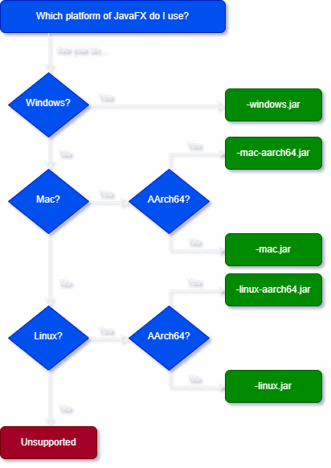

# Manual Recaf Installation

To install and launch Recaf 4.X without the launcher here's the process to follow:

## Step 1: Download Java 17 or higher

You can get OpenJDK from a variety of vendors. We recommend [_Adoptium_](https://adoptium.net/). You should be able to just click on the big _"Latest LTS Release"_ button to automatically get what you need. Otherwise, pick the _"Other platforms and versions"_ button and pick a specific JDK installer.

## Step 2: Download Recaf

You can grab the official releases from the [GitHub releases](https://github.com/Col-E/Recaf/releases). You will want to pick the larger JAR file with the `-all.jar` suffix.

If you want to try out features and fixes before they get bundled into a release you can also check the [CI](https://github.com/Col-E/Recaf/actions/workflows/build.yml) for nightly artifacts. You will need to be signed into GitHub to access the artifact downloads though.

For the sake of simplicity the file downloaded in this step will be referred to as `recaf.jar`.

## Step 3: Download JavaFX

You will need to download the four JavaFX artifacts suited for your operating system.

- https://mvnrepository.com/artifact/org.openjfx/javafx-base
- https://mvnrepository.com/artifact/org.openjfx/javafx-graphics
- https://mvnrepository.com/artifact/org.openjfx/javafx-controls
- https://mvnrepository.com/artifact/org.openjfx/javafx-media

### How do I get the artifact for my system?

1. Pick a version from the displayed table.
   - This will take you to a page describing information about that specific version of the dependency. 
   - The oldest version we would recommend is `21` or any of its patch version updates _(Like `21.0.2`)_.
   - The newest version you can choose depends on your version of Java installed. JavaFX occasionally updates what version of Java it targets.
     - JFX 21 requires Java 17+
     - JFX 23 requires Java 21+
2. There will be a row labeled `Files`. Select `View All`. 
   - This will show you the list of each platform-specific release for the given version. 
   - Pick the appropriate platform for your operating system. You can find a flow-chart helper below.
3. Choose `javafx-<name>-<version>-<platform>-<arch>.jar`.
   - This should be one of the larger file variants in the list. 
   - Do this for each of the dependencies in the list above.
4. Put all four artifacts in a directory next to `recaf.jar`.
   - In this example I will name the directory `dependencies`.

**Platform flow-chart:**

## Step 4: Run Recaf with JavaFX in the classpath

Run the command `java -cp recaf.jar;dependencies/* software.coley.recaf.Main`.